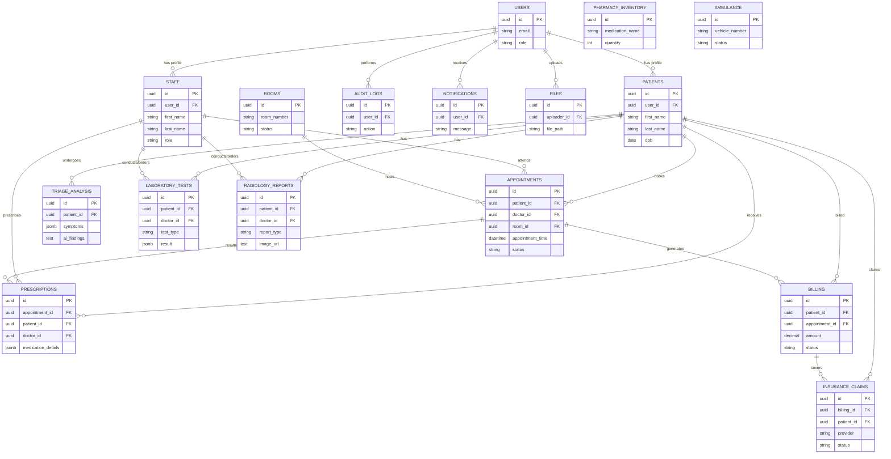

# Hospital Management System - ER Diagram

```mermaid
erDiagram
    USERS ||--o{ PATIENTS : "has profile"
    USERS ||--o{ STAFF : "has profile"
    USERS ||--o{ AUDIT_LOGS : "performs"
    USERS ||--o{ NOTIFICATIONS : "receives"
    USERS ||--o{ FILES : "uploads"

    PATIENTS ||--o{ APPOINTMENTS : "books"
    PATIENTS ||--o{ TRIAGE_ANALYSIS : "undergoes"
    PATIENTS ||--o{ PRESCRIPTIONS : "receives"
    PATIENTS ||--o{ LABORATORY_TESTS : "has"
    PATIENTS ||--o{ RADIOLOGY_REPORTS : "has"
    PATIENTS ||--o{ BILLING : "billed"
    PATIENTS ||--o{ INSURANCE_CLAIMS : "claims"

    STAFF ||--o{ APPOINTMENTS : "attends"
    STAFF ||--o{ PRESCRIPTIONS : "prescribes"
    STAFF ||--o{ LABORATORY_TESTS : "conducts/orders"
    STAFF ||--o{ RADIOLOGY_REPORTS : "conducts/orders"

    ROOMS ||--o{ APPOINTMENTS : "hosts"

    APPOINTMENTS ||--o{ PRESCRIPTIONS : "results in"
    APPOINTMENTS ||--o{ BILLING : "generates"

    BILLING ||--o{ INSURANCE_CLAIMS : "covers"

    USERS {
        uuid id PK
        string email
        string role
    }

    PATIENTS {
        uuid id PK
        uuid user_id FK
        string first_name
        string last_name
        date dob
    }

    STAFF {
        uuid id PK
        uuid user_id FK
        string first_name
        string last_name
        string role
    }

    APPOINTMENTS {
        uuid id PK
        uuid patient_id FK
        uuid doctor_id FK
        uuid room_id FK
        datetime appointment_time
        string status
    }

    TRIAGE_ANALYSIS {
        uuid id PK
        uuid patient_id FK
        jsonb symptoms
        text ai_findings
    }

    PRESCRIPTIONS {
        uuid id PK
        uuid appointment_id FK
        uuid patient_id FK
        uuid doctor_id FK
        jsonb medication_details
    }

    LABORATORY_TESTS {
        uuid id PK
        uuid patient_id FK
        uuid doctor_id FK
        string test_type
        jsonb result
    }

    RADIOLOGY_REPORTS {
        uuid id PK
        uuid patient_id FK
        uuid doctor_id FK
        string report_type
        text image_url
    }

    BILLING {
        uuid id PK
        uuid patient_id FK
        uuid appointment_id FK
        decimal amount
        string status
    }

    INSURANCE_CLAIMS {
        uuid id PK
        uuid billing_id FK
        uuid patient_id FK
        string provider
        string status
    }

    PHARMACY_INVENTORY {
        uuid id PK
        string medication_name
        int quantity
    }

    FILES {
        uuid id PK
        uuid uploader_id FK
        string file_path
    }

    ROOMS {
        uuid id PK
        string room_number
        string status
    }

    AMBULANCE {
        uuid id PK
        string vehicle_number
        string status
    }

    AUDIT_LOGS {
        uuid id PK
        uuid user_id FK
        string action
    }

    NOTIFICATIONS {
        uuid id PK
        uuid user_id FK
        string message
    }
```
